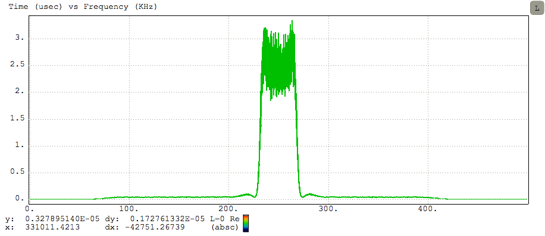

[SigPlot](http://sigplot.lgsinnovations.com)
=======

[](https://opensource.org/licenses/Apache-2.0) [](https://travis-ci.org/LGSInnovations/sigplot) [](.github/CONTRIBUTING.md#pull-requests) [](https://badge.fury.io/js/sigplot)

SigPlot provides fast, interactive plotting for software defined radio
applications using HTML5.



Getting Started
=================
```html
<html>
  <head>
    <title>SigPlot Standalone</title>
    <style>
      #plot {
        width: 600px;
        height: 400px;
      }
    </style>
  </head>
  <body>
    <div id="plot"></div>
    <script type="text/javascript" src="https://cdn.jsdelivr.net/npm/sigplot/dist/sigplot-debug.js"></script>
    <script type="text/javascript">
      var options = {};
      var plot = new sigplot.Plot(document.getElementById('plot'), options);
    </script>
  </body>
</html>
```

See [this jsFiddle](https://jsfiddle.net/ha09baqu/) as an example.  Additional
[examples and demos](http://sigplot.lgsinnovations.com/).


WebPack Quick Start
================================

These instructions assume you have Node.js/NPM correctly installed on your
system.

First install webpack:

```
npm install webpack -g
```

Then create a project for the SigPlot demo and install sigplot.

```bash
mkdir sigplot-webpack
cd sigplot-webpack
npm install sigplot
```

Next, create a file called `demo.js` with the following contents:

```javascript
let sigplot = require("sigplot");
let options = {};
let plot = new sigplot.Plot(document.getElementById('plot'), options);
```

Then, create a file called `index.html` with the following contents:

```html
<html>
  <head>
    <title>SigPlot Webpack</title>
    <style>
      #plot {
        width: 600px;
        height: 400px;
      }
    </style>
  </head>
  <body>
    <div id="plot"></div>
    <script type="text/javascript" src="bundle.js" charset="utf-8"></script>
  </body>
</html>
```

Use webpack to compile the bundle:

```bash
webpack ./demo.js bundle.js
```

Then open index.html in your webbrowser.

Contributing
=====================
See [CONTRIBUTING.md](CONTRIBUTING.md).

License
=====================
Licensed to the LGS Innovations (LGS) under one
or more contributor license agreements.  See the NOTICE file
distributed with this work for additional information
regarding copyright ownership.  LGS licenses this file
to you under the Apache License, Version 2.0 (the
"License"); you may not use this file except in compliance
with the License.  You may obtain a copy of the License at
 
  http://www.apache.org/licenses/LICENSE-2.0
 
Unless required by applicable law or agreed to in writing,
software distributed under the License is distributed on an
"AS IS" BASIS, WITHOUT WARRANTIES OR CONDITIONS OF ANY
KIND, either express or implied.  See the License for the
specific language governing permissions and limitations
under the License.
